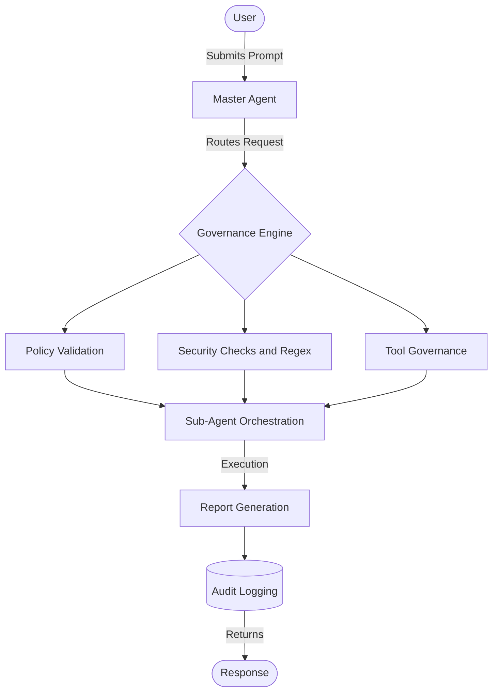
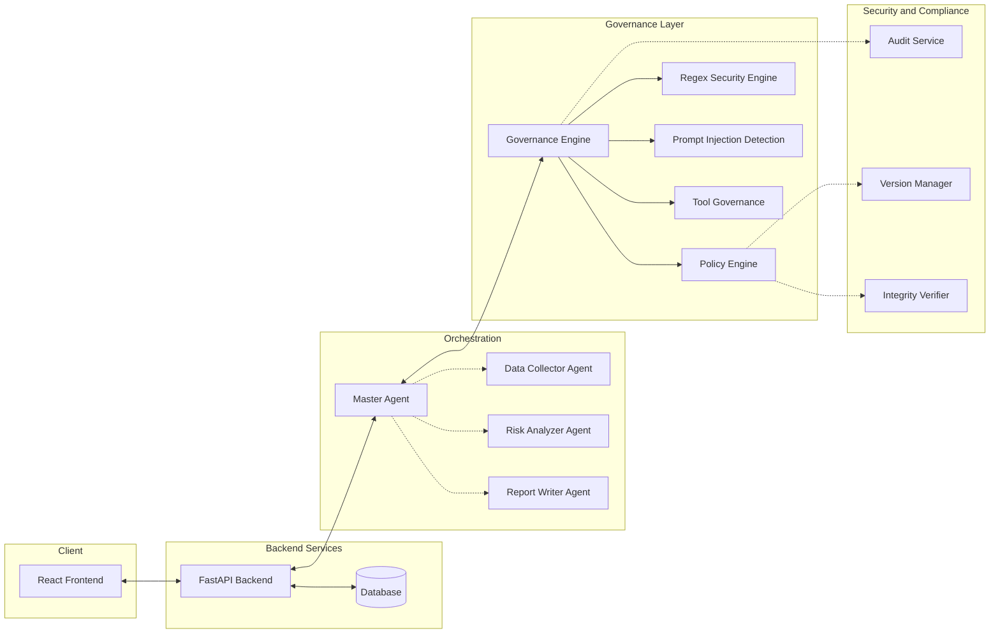
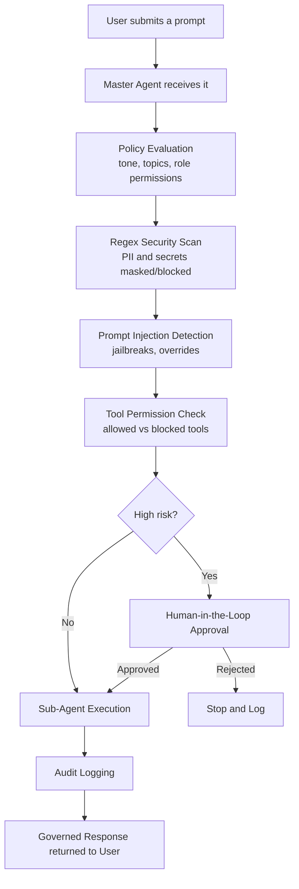
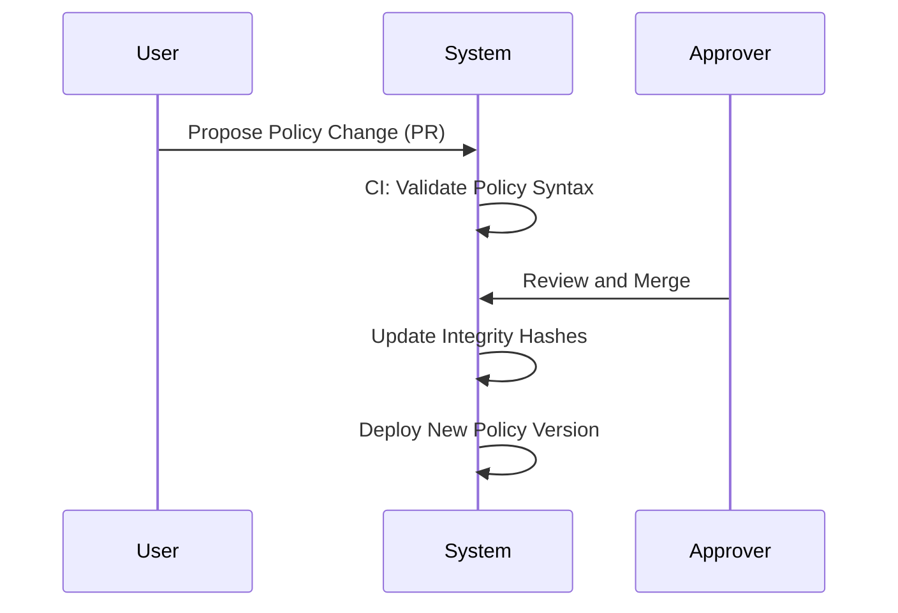
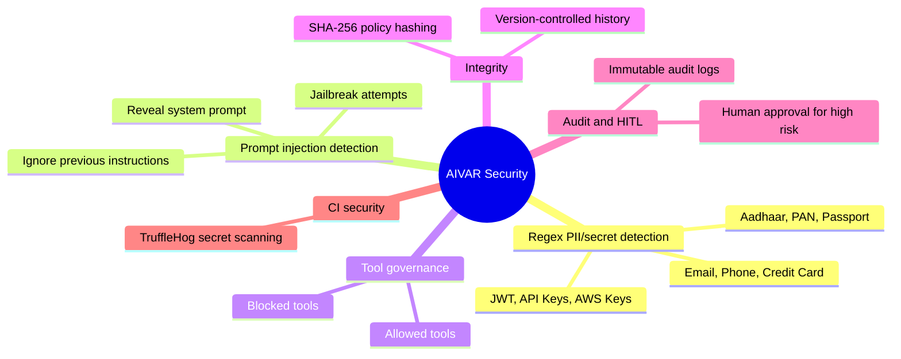
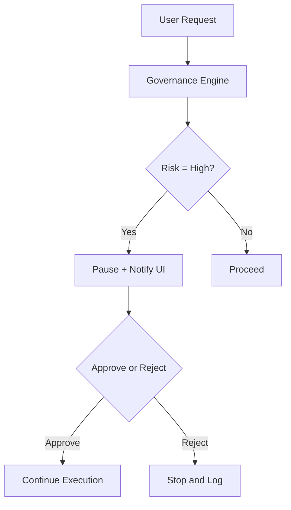
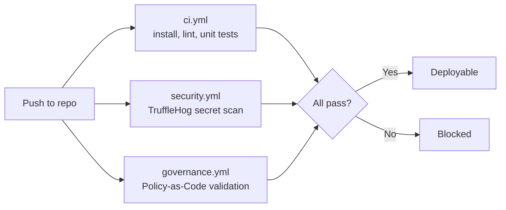
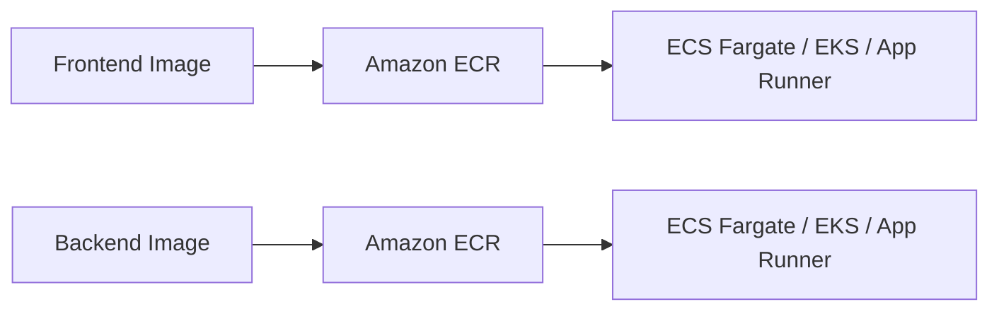

# AIVAR — Enterprise AI Governance Platform

> **A**rtificial **I**ntelligence **V**alidation **A**nd audit **R**outing — a production-grade platform that enforces Policy-as-Code, runtime governance, and security for AI systems, sitting *between* users and LLMs so nothing reaches the model ungoverned.

---

## Table of Contents

1. [Problem Statement](#1-why-this-project-exists-problem-statement)
2. [High-Level Idea](#2-high-level-idea)
3. [System Architecture](#3-system-architecture)
4. [End-to-End Request Flow](#4-end-to-end-request-flow)
5. [Core Components](#5-core-components)
6. [Policy-as-Code & Governance-as-Code](#6-policy-as-code--governance-as-code)
7. [Security Features](#7-security-features-at-a-glance)
8. [Human-in-the-Loop (HITL)](#8-human-in-the-loop-hitl-flow)
9. [Tech Stack](#9-tech-stack)
10. [CI/CD Pipeline](#10-cicd-pipeline)
11. [Folder Structure](#11-folder-structure)
12. [Deployment (AWS)](#12-deployment-aws-ready)
13. [Local Setup](#13-local-setup)
14. [Why This Is Production-Grade](#14-why-this-is-production-grade-not-just-a-demo)
15. [Roadmap](#15-roadmap)

---

## 1. Why This Project Exists (Problem Statement)

As organizations adopt LLMs and AI agents, a critical gap emerges: **there is no standard layer to govern AI systems before, during, and after execution.**

Without governance, AI systems can:

| Risk | Description |
|---|---|
| 🧠 Hallucination | Confidently generating false information |
| 💉 Prompt Injection | Malicious inputs bypassing safety instructions |
| 🔓 Data Leakage | PII, credentials, or secrets exposed in prompts/outputs |
| 🤖 Unauthorized Tool Use | Agents calling APIs/DBs without oversight |
| 🕵️ No Auditability | No record of who asked what, or why the AI acted |
| ✍️ No Explainability | No visibility into *why* a decision was made |
| 🔐 No Integrity Checks | Policies silently tampered with |
| 👤 No Human Oversight | Fully autonomous, high-stakes decisions |
| 📉 Configuration Drift | Live system diverges from intended policy |

These aren't just bugs — in an enterprise setting, they're **security, legal, and compliance risks.**

**AIVAR's answer:** treat governance as the *architecture*, not an add-on. Every request is evaluated, checked, and logged before it ever touches the LLM.

---

## 2. High-Level Idea



The user only ever talks to **one chatbot** — the **Master Agent**. Internally, it silently coordinates governance checks and specialized sub-agents.

---

## 3. System Architecture



**Key idea:** the Governance Layer is not a filter bolted onto the AI — it's the orchestrator the Master Agent must pass through before any sub-agent runs.

---

## 4. End-to-End Request Flow



If **any** check fails, execution stops there — the request never reaches the LLM/tools.

### Governance workflow (policy lifecycle)



---

## 5. Core Components

| Component | Role |
|---|---|
| **Master Agent** | Single entry point; receives requests, calls governance, delegates to sub-agents, merges results |
| **Data Collector Agent** | Gathers context/data needed for the task |
| **Risk Analyzer Agent** | Applies governance rules, scores severity of risks |
| **Report Writer Agent** | Produces the final structured, human-readable output |
| **Governance Engine** | Central decision-maker — orchestrates Policy, Security, Injection, and Tool checks |
| **Policy Engine** | Loads and evaluates Policy-as-Code (YAML) |
| **Regex Security Engine** | Detects/masks PII & secrets (email, phone, Aadhaar, PAN, JWT, AWS keys, etc.) |
| **Prompt Injection Detection** | Rule-based detection of jailbreak/override attempts |
| **Tool Governance** | Whitelists/blacklists tool execution per policy |
| **Audit Service** | Immutable logging of every decision and action |
| **Version Manager** | Git-like tracking of policy/config versions |
| **Integrity Verifier** | SHA-256 hash verification to detect tampering |
| **Drift Detector** | Flags divergence between live config and source of truth |

---

## 6. Policy-as-Code & Governance-as-Code

Instead of hardcoding rules in Python, AIVAR externalizes them:

```yaml
# Example: policy.yaml (illustrative)
policy:
  allowed_tools: ["search_docs", "fetch_report"]
  blocked_tools: ["delete_file", "send_email"]
  severity_thresholds:
    high: require_human_approval
    medium: log_and_warn
    low: allow
```

- **Policy-as-Code** → defines *what* is allowed.
- **Governance-as-Code** → defines *how* the whole system behaves (which modules are enabled, enforcement strictness, approval routing).

Benefits: version-controlled, peer-reviewable, testable in CI, and swappable without redeploying code.

---

## 7. Security Features at a Glance



Detected sensitive patterns include: Email, Phone, Credit Card, CVV, Aadhaar, PAN, Passport, Bank Account, IFSC, IPv4/IPv6, JWT, API Keys, AWS Keys, Generic Secrets, URLs.

---

## 8. Human-in-the-Loop (HITL) Flow



---

## 9. Tech Stack

| Layer | Technologies |
|---|---|
| **Frontend** | React, Vite, Tailwind CSS |
| **Backend** | Python 3.10+, FastAPI, Pydantic |
| **AI/Agents** | LangChain (agent orchestration), OpenAI-compatible LLMs |
| **Governance** | Policy-as-Code (YAML), custom Regex engine, rule-based injection detection |
| **Database** | SQLite (dev) → PostgreSQL (prod, via SQLAlchemy) / Supabase-ready |
| **DevOps** | Docker, Docker Compose, GitHub Actions (ci.yml, security.yml, governance.yml) |
| **Cloud** | AWS-ready — ECR, ECS/EKS, App Runner |

---

## 10. CI/CD Pipeline



Only code that passes **all three** pipelines is deployable — governance is validated with the same rigor as functionality.

---

## 11. Folder Structure

```text
AIVAR/
├── backend/
│   ├── app/
│   │   ├── agents/        # Master + Sub-Agent logic
│   │   ├── api/            # API endpoints
│   │   ├── core/           # Config & shared components
│   │   ├── governance/     # Governance Engine, Policies, Security
│   │   ├── models/         # DB & Pydantic models
│   │   └── services/       # Audit, HITL, business logic
│   ├── tests/
│   ├── Dockerfile
│   └── requirements.txt
├── frontend/
│   ├── src/
│   │   ├── components/
│   │   ├── pages/           # Chat, Dashboard, Policy Mgmt, Audit Logs
│   │   └── services/
│   ├── Dockerfile
│   └── package.json
├── .github/workflows/       # ci, security, governance
├── docker-compose.yml
└── README.md
```

---

## 12. Deployment (AWS-Ready)



Frontend and backend are independently containerized, so they scale independently under real load.

---

## 13. Local Setup

**With Docker (recommended):**
```bash
git clone <repo-url>
cd AIVAR
docker-compose up --build
# Frontend → http://localhost:5173
# Backend  → http://localhost:8000
```

**Manual:**
```bash
# Backend
cd backend
python -m venv venv && source venv/bin/activate
pip install -r requirements.txt
uvicorn app.main:app --reload

# Frontend
cd frontend
npm install
npm run dev
```

---

## 14. Why This Is Production-Grade (Not Just a Demo)

- **Governance-first design** — security is the orchestrator, not a wrapper
- **Modular architecture** — UI, API, Orchestration, Governance are cleanly separated
- **Configuration-driven** — behavior changes via policy, not code edits
- **Fully auditable** — every decision is logged, hashed, and versioned
- **Containerized & cloud-ready** — consistent across dev/test/prod, deployable to AWS out of the box
- **CI-enforced quality** — code and *policy* are both tested automatically

---

## 15. Roadmap

- RBAC & SSO (OAuth/SAML)
- Redis for caching, sessions, rate limiting
- Streaming token responses
- Multi-model routing (cost/performance/policy-based)
- Observability (Datadog/Prometheus)
- Multi-tenant governance regimes

---

## License

MIT License — see `LICENSE` file for details.
