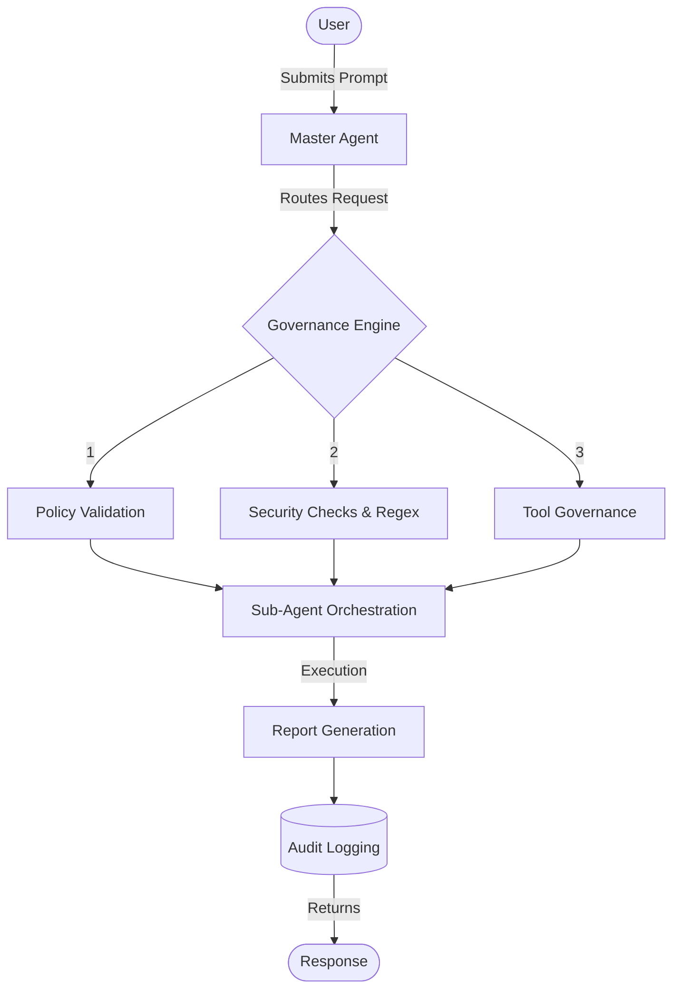
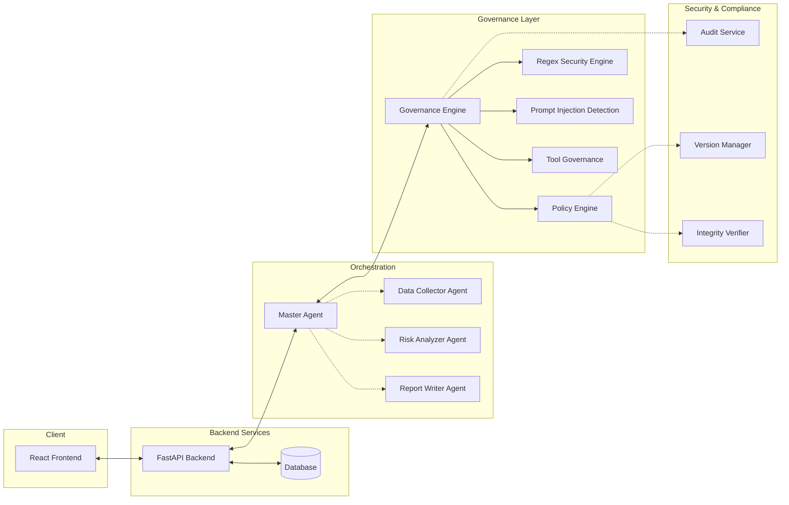
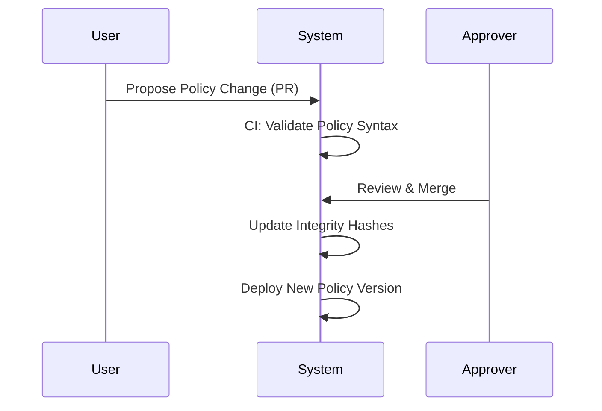

# AIVAR: Enterprise AI Governance Platform

> A production-grade platform enforcing Policy-as-Code, runtime governance, and security for modern AI systems.

---

## 2. Project Overview

AIVAR (Artificial Intelligence Validation and Audit Routing) is a comprehensive, open-source AI Governance platform designed for enterprise environments. It sits between users and Large Language Models (LLMs), acting as a strict governance layer that ensures every AI interaction is safe, compliant, and auditable.

As organizations increasingly adopt generative AI, the need for robust AI Governance has never been more critical. Without governance, AI models operate as black boxes, introducing risks such as data leakage, unapproved tool usage, and non-compliance with corporate policies. Modern AI systems require governance *before* interacting with LLMs to prevent these issues proactively rather than reacting to them after the fact. AIVAR provides this essential control layer.

---

## 3. Problem Statement

While LLMs offer immense potential, their deployment in enterprise settings introduces significant real-world challenges:

- **AI Hallucinations:** Models generating false or misleading information with high confidence.
- **Prompt Injection:** Malicious inputs designed to manipulate the AI into bypassing safety constraints or executing unauthorized actions.
- **Sensitive Data Leakage:** Accidental exposure of Personally Identifiable Information (PII), credentials, or proprietary data in prompts.
- **Lack of Runtime Governance:** Static policies fail to protect against dynamic threats during live interactions.
- **Unauthorized Tool Execution:** Agents independently executing tools (like database queries or API calls) without oversight.
- **No Auditability:** Inability to trace who asked what, what the AI did, and why it made specific decisions.
- **No Explainability:** Lack of insight into the reasoning behind the AI's actions.
- **No Integrity Verification:** Risk of modified or corrupted policies altering the system's behavior.
- **No Human-in-the-Loop:** Fully autonomous systems making critical decisions without human oversight.
- **Configuration Drift:** Inconsistencies between defined policies and the actual running configuration over time.
- **Lack of Policy Enforcement:** Guidelines existing on paper but not enforced technically at runtime.

In an enterprise environment, these issues are not just technical bugs; they are major security, legal, and reputational risks.

---

## 4. Our Approach

AIVAR solves these problems through a **Governance-First Architecture**. Instead of treating governance as an afterthought, AIVAR enforces it as the core orchestrator of all AI activity. 

Every user request passes through the Governance Engine before it ever reaches the AI. This ensures that policies are validated, security checks are passed, and tool execution permissions are verified.

### Workflow Overview



---

## 5. System Architecture

AIVAR utilizes a modular, microservices-oriented architecture to separate concerns and ensure scalability.

### Core Components

- **Frontend:** A modern React application providing the user interface for chatting, managing policies, viewing audits, and handling Human-in-the-Loop approvals.
- **Backend:** A robust Python API (FastAPI) handling request routing, logic execution, and database interactions.
- **Master Agent:** The central orchestrator that receives user requests, interacts with the Governance Engine, and delegates tasks to specialized sub-agents.
- **Sub-Agents (Data Collector, Risk Analyzer, Report Writer):** Specialized AI agents that perform specific tasks under the strict supervision of the Master Agent.
- **Governance Engine:** The core decision-maker that evaluates requests against defined policies and security rules.
- **Policy Engine:** Manages and evaluates Policy-as-Code definitions.
- **Regex Security Engine:** Scans inputs and outputs for sensitive data (PII, secrets) using pattern matching.
- **Prompt Injection Detection:** Analyzes prompts for malicious intent or manipulation attempts.
- **Tool Governance:** Controls which tools sub-agents are allowed to use based on policies.
- **Audit Service:** Records all interactions, decisions, and policy evaluations for compliance reporting.
- **Version Manager:** Tracks versions of policies and configurations to ensure consistency.
- **Integrity Verifier:** Cryptographically verifies that policies and configurations have not been tampered with.
- **Database:** Stores chat history, audit logs, and configuration states.

### Architecture Diagram



---

## 6. Complete Request Workflow

When a user submits a prompt, it undergoes a rigorous, multi-stage process:

1. **User Prompt:** The user submits a request via the frontend.
2. **Master Agent:** The request is received by the Master Agent.
3. **Policy Evaluation:** The Governance Engine checks the request against active policies (e.g., tone, allowed topics).
4. **Regex Scan:** The prompt is scanned for PII (like SSNs, emails) and secrets.
5. **Prompt Injection Detection:** The system analyzes the prompt to ensure it's not attempting to bypass instructions.
6. **Tool Permission Check:** If the request requires tools (e.g., fetching a document), the system verifies if the requested tools are permitted under current governance rules.
7. **HITL Check (Human-in-the-Loop):** If the action is deemed high-risk, execution pauses pending explicit human approval.
8. **Sub-Agent Execution:** Once all checks pass, the Master Agent delegates the task to the appropriate Sub-Agents.
9. **Audit Logging:** Every step, including the original prompt, governance decisions, and final output, is logged immutably.
10. **Response:** The final, governed response is returned to the user.

---

## 7. Feature Implementation

### Master Agent
- **Purpose:** Acts as the single point of entry and orchestration for all AI tasks.
- **Implementation:** Built using Python and agent orchestration frameworks. It receives requests, calls the Governance Engine, and coordinates sub-agents.
- **How it works:** It acts as a manager, breaking down complex tasks and assigning them to specialized workers while ensuring all work complies with rules.
- **Benefits:** Centralized control, easier monitoring, and streamlined governance enforcement.

### Sub-Agent Architecture
- **Purpose:** Segregates duties among specialized AI models.
- **Implementation:** Distinct agent classes (Data Collector, Risk Analyzer, Report Writer) with scoped responsibilities.
- **How it works:** The Master Agent routes specific sub-tasks to these agents. They execute their narrow tasks and return results.
- **Benefits:** Improved accuracy, better security (least privilege), and easier debugging.

### Policy-as-Code
- **Purpose:** Defines governance rules as version-controlled code rather than manual configurations.
- **Implementation:** YAML/JSON based policy definitions stored alongside the application code.
- **How it works:** The Policy Engine reads these files and evaluates requests against them dynamically.
- **Benefits:** Reproducibility, peer review for policy changes, and seamless CI/CD integration.

### Governance-as-Code
- **Purpose:** Extends Policy-as-Code to encompass the entire governance lifecycle, including tool permissions and routing rules.
- **Implementation:** Integrated into the core backend logic, loading configurations at startup.
- **How it works:** Determines not just what is allowed, but *how* the system should behave under specific governance states.
- **Benefits:** Standardized, testable, and reliable governance application.

### Runtime Policy Enforcement
- **Purpose:** Ensures policies are enforced during execution, not just statically checked beforehand.
- **Implementation:** Middleware/interceptors within the agent execution loop.
- **How it works:** Checks conditions actively while agents are generating responses or attempting to use tools.
- **Benefits:** Protection against dynamic threats that static analysis might miss.

### Regex-based Sensitive Data Detection
- **Purpose:** Prevents the leakage of sensitive information.
- **Implementation:** Pre-defined regular expressions scanning inputs and outputs.
- **How it works:** Identifies patterns matching SSNs, credit cards, emails, etc., and redacts or blocks the request.
- **Benefits:** Immediate, low-latency protection against common data leaks.

### Prompt Injection Detection
- **Purpose:** Secures the AI against manipulative inputs.
- **Implementation:** Heuristic analysis and secondary LLM checks to evaluate the intent of the prompt.
- **How it works:** Detects patterns common in jailbreaks or attempts to override system prompts.
- **Benefits:** Maintains the integrity and intended behavior of the AI models.

### Tool Governance
- **Purpose:** Controls which actions agents can perform.
- **Implementation:** A registry of allowed tools mapped to specific policies or user roles.
- **How it works:** Before an agent executes a tool, the framework verifies permission.
- **Benefits:** Prevents AI from taking unauthorized actions (e.g., deleting files, sending unauthorized emails).

### Human-in-the-Loop (HITL)
- **Purpose:** Requires human approval for sensitive or high-impact actions.
- **Implementation:** An asynchronous pause in execution that triggers a notification in the UI.
- **How it works:** The system waits until an authorized user reviews and approves/rejects the pending action.
- **Benefits:** Ultimate safety net for critical operations.

### Audit Logging
- **Purpose:** Provides a complete, immutable record of system activity.
- **Implementation:** Structured logging to a database.
- **How it works:** Captures timestamps, user IDs, request payloads, governance decisions, and AI responses.
- **Benefits:** Compliance, troubleshooting, and security investigations.

### Version Management
- **Purpose:** Tracks changes to policies and system configurations.
- **Implementation:** Git-like tracking of policy files.
- **How it works:** Ensures that every request is evaluated against a known, specific version of the rules.
- **Benefits:** Rollbacks, consistency, and clear audit trails of policy changes.

### Integrity Verification
- **Purpose:** Detects unauthorized tampering with policies.
- **Implementation:** Cryptographic hashing (e.g., SHA-256) of policy files.
- **How it works:** At startup and runtime, the system verifies the hash of the active policies against a known good state.
- **Benefits:** Prevents malicious actors from silently weakening governance rules.

### Drift Detection
- **Purpose:** Identifies when the running system configuration deviates from the desired state.
- **Implementation:** Periodic comparisons between the loaded configuration in memory and the source of truth (files/DB).
- **How it works:** Alerts administrators if a discrepancy is found.
- **Benefits:** Ensures continuous compliance and highlights unauthorized manual changes.

### CI Pipeline & Security Pipelines
- **Purpose:** Automates testing and security checks during development.
- **Implementation:** GitHub Actions workflows (`ci.yml`, `security.yml`, `governance.yml`).
- **How it works:** Runs unit tests, secret scanning, and policy validation on every commit.
- **Benefits:** High code quality, early vulnerability detection, and reliable deployments.

### Docker & Docker Compose
- **Purpose:** Ensures consistent environments across development, testing, and production.
- **Implementation:** Multi-stage `Dockerfile`s for frontend and backend, orchestrated by `docker-compose.yml`.
- **How it works:** Packages the application and its dependencies into isolated containers.
- **Benefits:** "Works on my machine" reliability, easy onboarding, and readiness for cloud deployment.

---

## 8. Folder Structure

```text
AIVAR/
├── backend/                # Python FastAPI Backend
│   ├── app/                # Core application code
│   │   ├── agents/         # Master and Sub-Agent logic
│   │   ├── api/            # API endpoints
│   │   ├── core/           # Configuration and central components
│   │   ├── governance/     # Governance Engine, Policies, Security
│   │   ├── models/         # Database and Pydantic models
│   │   └── services/       # Business logic (Audit, HITL)
│   ├── tests/              # Backend unit and integration tests
│   ├── Dockerfile          # Backend container definition
│   └── requirements.txt    # Python dependencies
├── frontend/               # React Frontend
│   ├── src/                # UI source code
│   │   ├── components/     # Reusable UI components
│   │   ├── pages/          # Application views (Chat, Dashboard, etc.)
│   │   └── services/       # API integration
│   ├── Dockerfile          # Frontend container definition
│   └── package.json        # Node.js dependencies
├── .github/
│   └── workflows/          # CI/CD pipelines (ci, security, governance)
├── docker-compose.yml      # Local orchestration
└── README.md               # Project documentation
```

---

## 9. Technology Stack

**Frontend**
- React (UI Framework)
- Tailwind CSS (Styling)
- Vite (Build Tool)

**Backend**
- Python 3.10+
- FastAPI (Web Framework)
- Pydantic (Data Validation)

**AI & Governance**
- LangChain / LlamaIndex (Agent Orchestration capabilities)
- OpenAI API (or compatible LLMs)

**Database**
- SQLite (Development) / PostgreSQL (Production ready via SQLAlchemy)

**DevOps & Cloud**
- Docker & Docker Compose
- GitHub Actions (CI/CD)
- Ready for AWS (ECR, ECS)

---

## 10. Project Workflows

### Development Workflow
Developers write code, run local tests using pytest, and preview changes via the local Vite server. Commits to the repository trigger GitHub Actions for automated validation.

### Governance Workflow


### Runtime Workflow
See section 6 (Complete Request Workflow).

### Security & CI Workflow
Every push triggers:
1. `ci.yml`: Unit tests and build verification.
2. `security.yml`: Secret scanning (TruffleHog) and vulnerability checks.
3. `governance.yml`: Validation of Policy-as-Code definitions.

---

## 11. Docker Support

AIVAR is fully containerized for reliability and scalability.

- **Frontend & Backend Independence:** The frontend and backend are built as entirely separate Docker images. This allows them to be scaled independently in production.
- **Dockerfiles:** Optimized, multi-stage builds are used to minimize image size and attack surface.
- **Docker Compose:** A `docker-compose.yml` file is provided to spin up the entire stack locally with a single command, bridging the networks automatically.
- **AWS Compatibility:** The resulting images are standard OCI-compliant containers, ready to be pushed to Amazon ECR.

---

## 12. CI/CD

AIVAR utilizes GitHub Actions for continuous integration, ensuring that code and governance policies remain robust:

- **`ci.yml`**: Runs the standard development pipeline. It sets up the environment, installs dependencies, runs linters, and executes the unit test suite to ensure code correctness.
- **`security.yml`**: Focuses on code safety. It runs tools like TruffleHog to scan for accidentally committed secrets, API keys, or credentials, preventing security breaches.
- **`governance.yml`**: Validates the core value proposition of the platform. It specifically tests the integrity of the Policy-as-Code files, ensuring syntax is correct and policies are valid before they can be merged.

---

## 13. Security Features

AIVAR is built with security as a primary requirement, not an add-on:

- **Policy Validation:** Strict enforcement of allowed behaviors.
- **Regex Scanning:** Immediate detection and blocking of sensitive patterns (PII, credit cards).
- **Prompt Injection Detection:** Defense against malicious user inputs designed to hijack the AI.
- **Integrity Verification:** Cryptographic assurance that rules haven't been tampered with.
- **Version Control:** Complete history of policy changes for accountability.
- **Audit Logging:** Immutable records of all actions for forensic analysis.
- **Human Approval (HITL):** Mandatory human sign-off for critical actions.
- **Secret Scanning (TruffleHog):** Automated CI checks preventing credentials in source code.

---

## 14. AWS Deployment

AIVAR's architecture is explicitly designed to be cloud-native and AWS-ready.

Because the application is fully containerized with independent frontend and backend images, deployment to AWS is streamlined:
- **Amazon ECR (Elastic Container Registry):** The Docker images can be pushed directly to independent ECR repositories.
- **Amazon ECS (Elastic Container Service) / EKS (Elastic Kubernetes Service):** The containers can be deployed on ECS (using Fargate for serverless compute) or EKS for advanced orchestration, allowing the frontend and backend to scale based on independent load profiles.
- **AWS App Runner:** For simpler deployments, App Runner can directly host the containerized web services.

*(Note: Deployment commands are omitted. The architecture supports standard container deployment methodologies.)*

---

## 15. Why This Is Production Ready

AIVAR moves beyond simple chatbot demonstrations into the realm of enterprise-grade software.

- **Modular Architecture:** Clear separation of concerns between UI, API, Orchestration, and Governance allows teams to work independently.
- **Governance-First Design:** Security is not an afterthought; it is the orchestrator.
- **Configuration-Driven Development:** System behavior is modified via policies, not hardcoded logic.
- **Policy-as-Code:** Enables reviewable, auditable, and testable governance rules.
- **Containerization:** Ensures the system runs predictably in any environment.
- **Automated Validation:** CI pipelines ensure code and policy quality on every change.
- **Auditability & Maintainability:** Extensive logging and a structured codebase ensure long-term viability.

Organizations can confidently use AIVAR as a foundation, extending its policies and sub-agents to meet specific business needs without compromising security.

---

## 16. Future Enhancements

The roadmap for AIVAR includes expanding its enterprise capabilities:

- **RBAC & SSO:** Integration with corporate identity providers (OAuth/SAML) for Role-Based Access Control.
- **Redis Integration:** For caching, session management, and robust rate limiting.
- **Streaming Responses:** Real-time token streaming for a better user experience during long generation tasks.
- **Multi-Model Routing:** Intelligently routing requests to different LLMs (e.g., GPT-4 vs. Claude) based on cost, performance, or policy requirements.
- **Observability:** Deep integration with tools like Datadog or Prometheus for system metrics.
- **Multi-Tenant Governance:** Supporting different governance regimes for different departments within the same instance.

---

## 17. Setup Guide

### Requirements
- Node.js (v18+)
- Python (3.10+)
- Docker & Docker Compose

### Running Locally with Docker (Recommended)
1. Clone the repository.
2. Create necessary `.env` files in `backend/` and `frontend/` (copy from `.env.example` if available).
3. Run: `docker-compose up --build`
4. Access the frontend at `http://localhost:5173` and the backend API at `http://localhost:8000`.

### Manual Setup
**Backend:**
```bash
cd backend
python -m venv venv
source venv/bin/activate  # or `venv\Scripts\activate` on Windows
pip install -r requirements.txt
uvicorn app.main:app --reload
```

**Frontend:**
```bash
cd frontend
npm install
npm run dev
```

---

## 18. Screenshots

*(Placeholders for future UI captures)*

- **[Dashboard]** - *System overview and metrics.*
- **[Chatbot]** - *User interface for governed AI interaction.*
- **[Governance Timeline]** - *Visual trace of a request passing through security checks.*
- **[Policy Management]** - *Interface for viewing Policy-as-Code definitions.*
- **[Audit Logs]** - *Table of system activity and decisions.*
- **[HITL Popup]** - *The Human-in-the-Loop approval prompt.*

---

## 19. Contributing

We welcome contributions to AIVAR! 
Please review our contribution guidelines (`CONTRIBUTING.md`) before submitting pull requests. Ensure all code passes the CI pipelines, including unit tests and security scans. For major architectural changes, please open an issue first to discuss the proposed design.

---

## 20. License

This project is licensed under the MIT License - see the LICENSE file for details.
